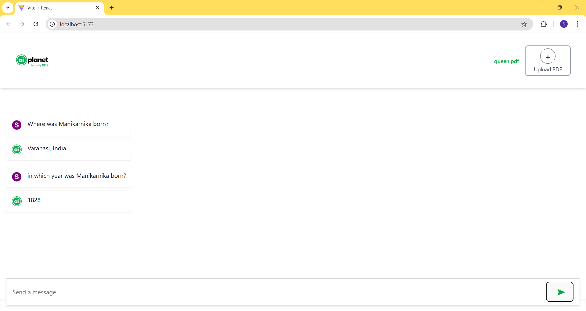

 # PDF-AI – Ask Questions About Your PDF

 A full-stack AI-powered application that allows users to upload PDF documents and ask natural language questions based on the document content. Built using React.js for the frontend and FastAPI + LangChain for the backend.

## Tech Stack

### Frontend:
- React.js  
- Tailwind CSS  
- Axios (for HTTP requests)  

### Backend:

- FastAPI  
- LangChain  
- PyMuPDF (for PDF parsing)  
- sentence-transformers, FAISS, Transformers (for semantic search & NLP)  
- torch  
- accelerate  
- requests  
- python-multipart  

### Features
- Upload PDF files  
- Ask questions related to the uploaded PDFs  
- AI-generated answers using NLP (LangChain + Transformers)  
- Persistent storage of document info  
- Simple and clean UI for interaction  
- Handles follow-up questions on the same document

## 📁 Folder Structure

PDF-AI/
├── backend/
│   ├── main.py               # FastAPI backend app
│   ├── requirements.txt      # Python dependencies
│   ├── venv/                 # Python virtual environment 
│   └── __pycache__/          # Python cache files (auto-generated)
├── frontend/
│   ├── node_modules/         # React dependencies (auto-generated)
│   ├── src/
│   │   ├── components/
│   │   │   ├── FileUpload.jsx      # Handles PDF upload
│   │   │   ├── QuestionForm.jsx    # Input field for user questions
│   │   │   └── AnswerDisplay.jsx   # Displays answers returned from backend
│   │   └── App.jsx            # Root React component

## Setup Instructions

Backend (FastAPI)
cd backend
python -m venv venv
source venv/bin/activate  # On Windows: venv\Scripts\activate
pip install -r requirements.txt
uvicorn main:app 

Frontend (React)
cd frontend
npm install
npm install axios
npm start

## API Endpoints
| Method | Endpoint   | Description                       |
| ------ | ---------- | --------------------------------- |
| POST   | `/upload/` | Upload PDF and process it         |
| POST   | `/ask/`    | Ask a question and get the answer |

## 📽 Demo

📽 Demo
Watch the application in action here:
[👉 Click to Watch Demo Video](https://drive.google.com/file/d/1Jbez-BCwz2dUWO4urk94iiS2iTLPwZwK/view?usp=sharing)

## 📸 Screenshots

## Notes
Works best for reasonably sized PDFs
Make sure to upload the PDF before asking a question
Clear and concise questions give better results

> Note: `venv/`, `node_modules/`, and `__pycache__/` folders are excluded from the repository using `.gitignore`.

